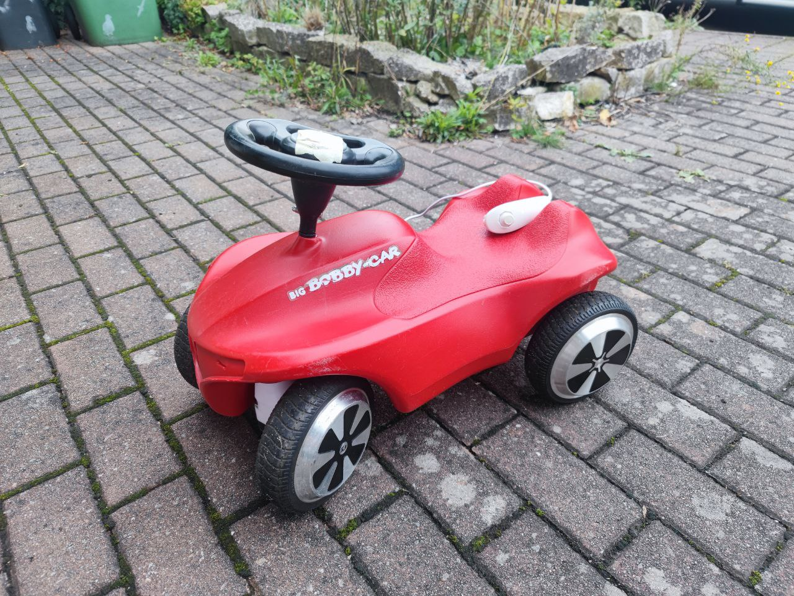
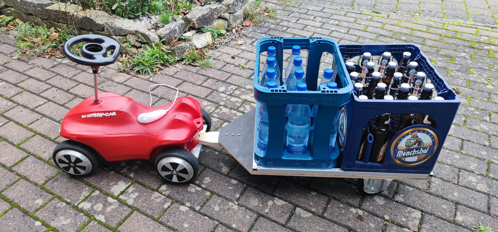

# Bobby_Car

## This repository is home of Donjoergo's motorized Bobby Car DIY project.
*The project was heavily inspired by [larsm's](https://larsm.org/allrad-e-bobby-car/) and [fisch's](https://figch.de/index.php?nav=bobbycar) project, so give them also a read!*

This DIY project is around a Bobby Car which is four-wheel-drive and motorized with the hardware of two cheap hoverboards. Also it features a trailer which can transport a 60x40cm Eurobox or 2 beverage crates or up to two people at once.

## Feature Wish List
For the wishlist of the features have a look into the [TODO list](./TODO%20List.md).
