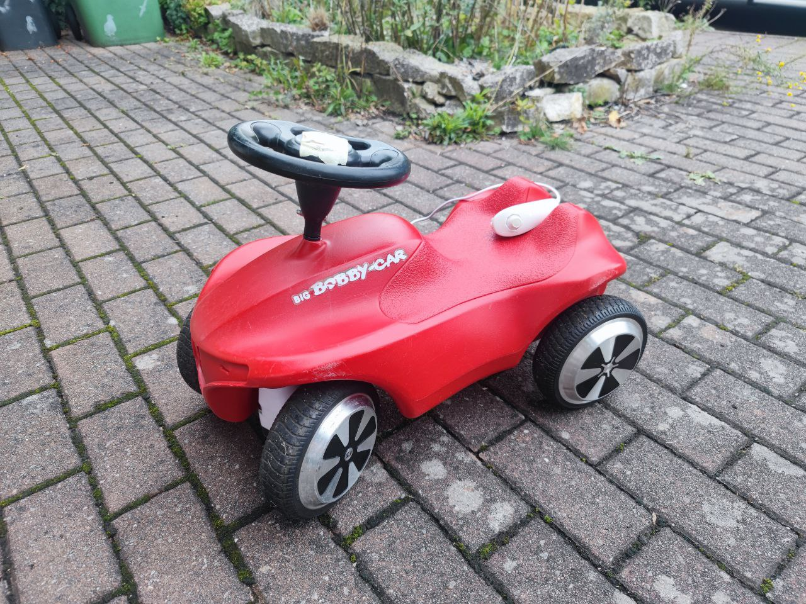
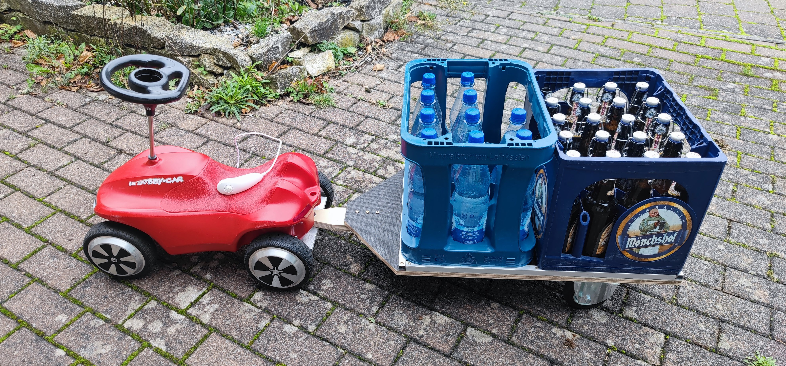

# Bobby_Car

## This repository is home of Donjoergo's motorized Bobby Car DIY project

*The project was heavily inspired by [larsm's](https://larsm.org/allrad-e-bobby-car/) and [fisch's](https://figch.de/index.php?nav=bobbycar) project, so give them also a read!*

This DIY project is around a Bobby Car which is four-wheel-driven and motorized with the hardware of two cheap hoverboards and additional cheap parts.

Additionally I built a trailer which can transport a 60x40 cm Eurobox or 2 beverage crates at once:

This trailer with two seats was built on the Macherfestival 2025:

## Components

### Rear Motor Mount

I started by mounting two motors from a used hoverboard to the rear of the bobby car. Generally I copied larsm's design and used a aluminium plate to mount the motors to.

### Front Motor Mount

In the front two additional motors from another hoverboard were used. Two mount them I first printed [larsm's front motor mount](https://seafile.larsm.org/f/ddee92e2aabd46ffb358/?dl). Unfortunately the mounts broke during a weekend with excessive test rides. I tried to hotfix them with two component adhesive but this didn't work wery well. In the end I redesigned the front motor mount and made it stronger in the crucial areas where it broke earlier.

### Steering

#### Steering Rod

Just like larsm I made the steering rod longer. For this I used a 10mm steel tube. To fixate against rattling and to guide the rod I also used a kitchen cutting board from IKEA. Adding a set collar prevents it from being pulled or pushed in the car's body.

#### Steering Wheel

I have swapped the original steering wheel with this cool [Racing Steering Wheel with Sounds](https://www.big.de/big_de/kategorien/kinderfahrzeuge/big-bobby-car/zubehoer/big-bobby-car-racing-sound-lenkrad-800056487-de.html) 😎.

For the future I want to design and 3d print my own steering wheel. It should be in a F1 racing design and should incoroporate a display for showing important telemtry data and I want to preserve the oroiginal horn 😁.

### Controller

This is the "big brain" of my electric Bobby Car where all the strings are connected together. In the future it will control everything from the motor driver boards to the display and the head lights. Currently it's just controlling one motor driver board, but I am working on it to get it smarter 😁

A cheap step down converter from Aliexpress converts the high voltage of the battery down to a healthy 5V. Right now I am using an Arduino Nano as the controller, but this will probably change and I will switch to an ESP32.

### Electronics

Now to the most fun part :)

#### Motors

**⚠️ Caution:**

Currently the front motors are not connected to the motor driver board and are just spinning freely. Should you also be doing something like this: Make sure that the lose wire ends of the motors are isolated! When two phases of the motor are connected together it can't spin freely anymore!

The motors are standard 350W BLDC hoverboard motors with 6'' diameter. Per default they are wired in a star configuration. It's possible to rewire the phases into a triangle configuration to get a higher top speed. Here a [good tutorial for motor rewiring](https://youtu.be/J-e7XiqqY7Q?si=S_LnG62dBHgK2Xvp) this can be found. I will probably do this also in the future.

#### Motor Driver Boards

I just reused the original driver boards from the hoverboards. I flashed a [new firmware](https://github.com/donjoergo/hoverboard-firmware-hack-FOC) onto them, with which I am able to communicate with the boards over UART.

#### Old Battery

Currently I am reusing one of the batteries from the old hoverboards. Charging is also straightforward as the original hoverboard charger can be reused.

While reusing the old batteries worked for the initial first tests rides, it has some downsides:

- As the batteries are quite old, the capacity (aka runtime) is not that great. Also the voltage drops pretty quickly as soon as you pull higher amounts of power. This happened to me quite often, and I am currently only using half of the motors!
- The original battery packs are 10S (42V). Making a battery pack with 12S (50.4V) will result in higher top speed 💨😁

#### New Battery Pack

For the future a 12S battery pack is planned. It will be made out of 18650 cells harvested from 3 old hoverboard battery packs.
I want to make a 12S4P battery pack for which I need 48 cells. 3 old battery packs have 60 cells, so I have 12 cells spare.

I will test the capacity of the old cells with an DL24 150W load tester and will configure a new pack out of that. Hopefully this low cost solution will solve some of the power issues.

##### BMS

For the new battery pack I want to keep charging as easy as it is right now. Only need to plug in one cable and it starts charging.
This means that I need a new BMS which can handle 12S packs.
After some searching and comparing the different manufacturers I chose the "8S-17S 60A" Smart BMS from Daly. As the BMS is "smart" I can read out telematry data over an app. I hope that I will also connect it to the Arduino controller via UART or CAN in the future.

#### Charger

For this task I will buy a cheap 50.4V charger from Aliexpress.
<!-- It works well and charges the battery pack in about 2 hours. It also has an integrated voltmeter which is nice to see the current state of charge of the battery pack. -->

Other options like fisch did it with exposing the balance leads and charging the cells directly would be to impractical for me. And I also would have only had a 60W iMAX B6 Balance Charger at hand. Charging a 12S pack with that would have been way to slow.

#### Throttle control

Currently I am using a Wii Nunchuck as a throttle control. It's not the most elegant solution, but it works.

In the future I will integrate the throttle control into the new steering wheel.

#### Main Switch

For switching on the motor driver boards I used a nice tactile push button with an integrated LED.

#### Emergency Switch

For this I used a XT60 loop key. It's a simple but effective way to cut the complete power.

### Bottom Cover

Currently it is just a piece of wood which is screwed into another wooden counterpart inside of the car's body. Eventually I will probably make a more robust construction as it's already falling apart on it's own.

A constuction from aluminium or acrylic glass could be two ideas.

## 3D Files

For the 3D files have a look at my [Makerworld account](https://makerworld.com/en/collections/8438302-bobby-car).

## Feature Wish List

For the wishlist of the features have a look into the [TODO list](./TODO%20List.md).

## Write me!

You have a question, something is unclear or you just want to contact me? Just write me a message here in Github! I appreciate your messages regarding my Electric Bobby Car Project. I speak Deutsch and English.

TODO: testen ob das geht
